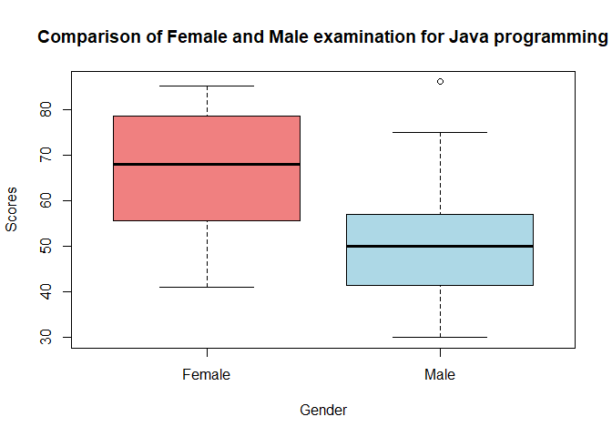

FA1_AFUNDAR
================
Audrie Lex L. Afundar
2024-02-01

## Question \#1

1.  Write the skewness program, and use it to calculate the skewness
    coefficient of the four examination subjects in results.txt
    (results.csv).

a.) What can you say about these data?

``` r
cat("Skewness for arch.1:", skewness(arch.1),"\n")
```

    ## Skewness for arch.1: -0.5085663

``` r
cat("Skewness for prog.1:",skewness(prog.1),"\n")
```

    ## Skewness for prog.1: -0.3104593

``` r
cat("Skewness for arch2:",skewness(arch2),"\n")
```

    ## Skewness for arch2: 0.4532101

``` r
cat("Skewness for prog2:",skewness(prog2),"\n")
```

    ## Skewness for prog2: -0.2799966

Based on the data provided, the skewness of all columns except arch2 are
all negative values. Therefore, arch.1, prog.1, and prog 2 have left
skewed distribution while arch2 have a right skewed distribution since
the value is positive.

------------------------------------------------------------------------

\*Pearson has given an approximate formula for the skewness that is
easier to calculate than the exact formula given in Equation 2.1.

b.) Write a program to calculate this and apply it to the data in
results.txt (results.csv). Is it a reasonable approximation?

``` r
P_arch1 <- (3*(mean(arch.1)-median(arch.1)))/sd(arch.1)
cat("Skewness for arch.1 using Pearon's:",P_arch1,"\n")
```

    ## Skewness for arch.1 using Pearon's: -0.5472727

``` r
P_prog1 <- (3*(mean(prog.1)-median(prog.1)))/sd(prog.1)
cat("Skewness for prog.1 using Pearson's:",P_prog1,"\n")
```

    ## Skewness for prog.1 using Pearson's: -0.5448956

``` r
P_arch2 <- (3*(mean(arch2)-median(arch2)))/sd(arch2)
cat("Skewness for arch2 using Pearson's:",P_arch2,"\n")
```

    ## Skewness for arch2 using Pearson's: 0.7196062

``` r
P_prog2 <- (3*(mean(prog2)-median(prog2)))/sd(prog2)
cat("Skewness for prog2 using Pearson's:",P_prog2,"\n")
```

    ## Skewness for prog2 using Pearson's: -0.4308381

By comparing Pearson’s formula with the built in skewness code, the
approximation from Pearson’s formula is far off than the correct answer.
Therefore, it was not a reasonable approximation.

## Question \#2

2.  For the class of 50 students of computing detailed in Exercise 1.1,
    use R to

a.) form the stem-and-leaf display for each gender, and discuss the
advantages of this representation compared to the traditional histogram;

``` r
female <-c(57, 59, 78, 79, 60, 65, 68, 71, 75, 48, 51, 55, 56, 41, 43, 44, 75, 78, 80, 81, 83, 83, 85)
male <-c(48, 49, 49, 30, 30, 31, 32, 35, 37, 41, 86, 42, 51, 53, 56, 42, 44, 50, 51, 65, 67, 51, 56, 58, 64, 64, 75)

stem(female)
```

    ## 
    ##   The decimal point is 1 digit(s) to the right of the |
    ## 
    ##   4 | 1348
    ##   5 | 15679
    ##   6 | 058
    ##   7 | 155889
    ##   8 | 01335

``` r
stem(male)
```

    ## 
    ##   The decimal point is 1 digit(s) to the right of the |
    ## 
    ##   3 | 001257
    ##   4 | 1224899
    ##   5 | 01113668
    ##   6 | 4457
    ##   7 | 5
    ##   8 | 6

With the data provided, it is clear that stem and leaf distribution is
far better at providing detailed and individual view of the data points.
Since histograms gives out the overall overview of the distribution, it
is not good to obtain the individual points.

------------------------------------------------------------------------

b.) construct a box-plot for each gender and discuss the findings.

``` r
boxplot(female, male, names = c("Female", "Male"), 
        main = "Comparison of Female and Male examination for Java programming",xlab="Gender",ylab="Scores",
        col = c("lightcoral", "lightblue"))
```

<!-- -->

The boxplot constructed from each gender shows that the female has a
higher score, mean, and median for the examination compared to the male.
