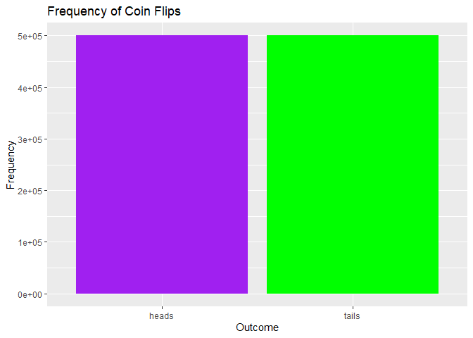

FA2_AFUNDAR
================
Audrie Lex L. Afundar
2024-02-14

Use R to illustrate that the probability of getting:

1)  a head is 0.5 if a fair coin is tossed repeatedly;
2)  an even number is 0.5 if a fair die is rolled repeatedly.
3)  a red card is 0.5 if cards are drawn repeatedly with replacement
    from awell-shuffled deck;

------------------------------------------------------------------------

1)  To find the probability of a side of a coin, it must be repeatedly
    done, the higher the size, the closer the probability is. With this,
    the flips size would be repeated 1000000 times to find the
    probability of getting a head in a flip.

With the code below, it performs 100000 coin flips and converted to a
data frame.

``` r
coin <- c('heads','tails')

flips <- sample(coin, size=flips_size, replace = TRUE)

frequency_flips <- table(flips)

freq_data <- as.data.frame(frequency_flips)

frequency_flips
```

    ## flips
    ##  heads  tails 
    ## 500009 499991

``` r
heads_perc <- freq_data[freq_data$flips == "heads", "Freq"]

heads_perc <- (heads_perc/flips_size)*100

heads_perc
```

    ## [1] 50.0009

The outcome came out as close to 50% in the 100000 times it was flipped.
Therefore, it is true that the outcome is 50% chance to get head in
flipping a coin.

The graph also shows the closeness between the frequency between the
two.

``` r
ggplot(freq_data, aes(x = flips, y = Freq)) +
  geom_bar(stat = "identity", fill = c("purple", "green")) +
  labs(title = "Frequency of Coin Flips", x = "Outcome", y = "Frequency")
```

<!-- -->
\_\_\_\_\_\_\_\_\_\_\_\_\_\_\_\_\_\_\_\_\_\_\_\_\_\_\_\_\_\_\_\_\_\_\_\_\_\_\_\_\_\_\_\_\_\_\_\_\_\_\_\_\_\_\_\_\_\_\_\_\_\_\_\_\_\_\_\_\_\_\_\_\_\_\_\_\_\_\_\_\_\_\_\_

2)  Same goes with the die, but it consists of 6 numbers, 3 even and 3
    odds. Which ultimately comes out as the percentage of getting an
    even or odd. The process is the same as the coinflip but use modulus
    to distinguish whether the die rolled into an even or an odd.

The code below shows the frequency of the die as well as the converted
data frame to get the percentage of getting an even number in rolling a
die.

``` r
die <- c('1','2','3','4','5','6')

flips_die <- sample(die, size=flips_size, replace = TRUE)

frequency_die <- table(flips_die)

freq_die <- as.data.frame(frequency_die)

frequency_die
```

    ## flips_die
    ##      1      2      3      4      5      6 
    ## 167380 166238 166414 166388 166884 166696

``` r
even_freq <- sum(freq_die[as.integer(freq_die$flips_die) %% 2 == 0, "Freq"])

even_perc <- (even_freq / flips_size) * 100

even_perc
```

    ## [1] 49.9322

The results shows a percentage close to 50%, it can be more accurate if
the size of rolled dice is larger. Although, this is sufficient that it
shows that getting an even in a rolled die is 50%.

The graph below also shows the frequency between all the numbers that
was picked during the simulation.

``` r
ggplot(freq_die, aes(x = flips_die, y = Freq, fill = flips_die)) +
  geom_bar(stat = "identity") +
  labs(title = "Frequency of the numbers on a die",
       x = "Die",
       y = "Frequency") +
  scale_fill_manual(values = c("1" = "blue", "2" = "red", "3" = "purple", "4" = "yellow", "5" = "green", "6" = "black"))
```

<!-- --> (c)
Since the problem only needs the color of the card, the numbers and face
are insignifacnt. Therefore, it is only needed to find the probability
of getting a red card and black card in a normal 52 shuffled deck.

It is also important to address that card\<=26 is possible since you
want to get a card from the 26 of the red cards in the shuffled deck.

With this, this is similar to the 2 problems, the frequencies are turned
to a dataframe then find the percentage of picking a red card.

``` r
red_cards <- 0
black_cards<-0

for (i in 1:flips_size){
  card <- sample(1:52, size=1, replace=TRUE)
  
  if(card<=26){
    red_cards <- red_cards+1
  }else{
    black_cards<-black_cards+1
  }
}


card_counts <- data.frame(
  Color = c("Red", "Black"),
  Frequency = c(red_cards, black_cards)
)


red_freq <- (red_cards/flips_size)*100

red_freq
```

    ## [1] 49.9357

With the results, it is shown that the percentage is close to 50%, it is
important to note that the percentage will approach to 50% more with a
larger scale size.

The graph below shows the graph of the frequencies in the results

``` r
ggplot(card_counts, aes(x = Color, y = Frequency, fill = Color)) +
  geom_bar(stat = "identity") +
  labs(title = "Frequency of Red and Black Cards",
       x = "Color",
       y = "Frequency") +
  scale_fill_manual(values = c("Red" = "red", "Black" = "black"))
```

<!-- -->
