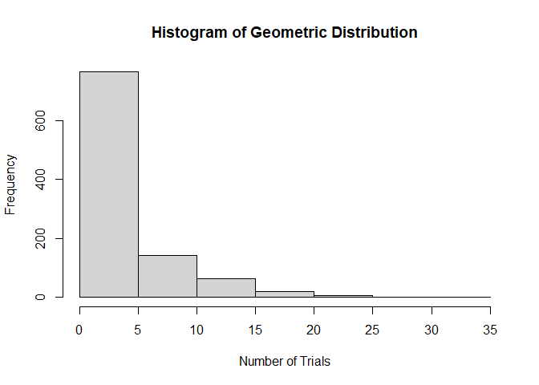

FA6_Afundar
================
Audrie Lex L. Afundar
2024-02-29

I. Geometric Distribution. Provide an R code for the geometric
distribution. The geometric distribution is a probability distribution
that models the number of trials required to achieve the first success
in a sequence of Bernoulli trials, where each trial has a constant
probability of success.

1.  Set the probability of success: p \<- 0.2

2.  Generate 1000 random variables from the geometric distribution.

3.  Calculate some basic statistics:

mean_x \<- mean(x)

var_x \<- var(x)

sd_x \<- sd(x)

``` r
p <-0.2
n=1000

x<-rgeom(n,prob=p)
mean_x<-round(mean(x), 2)
var_x<-round(var(x),2)
sd_x<-round(sd(x),2)
fsuc<-which(x==1)[1]
```

4.  Print the results in item 3 with the following output (string):

Number of trials required to achieve first success:

Mean (in 2 decimal places):

Variance (in 2 decimal places):

Sandard deviation ( in 2 decimal places):

``` r
cat("\nNumber of trials for the first success:", fsuc)
```

    ## 
    ## Number of trials for the first success: 4

``` r
cat("\nMean of the geometric distribution:", mean_x)
```

    ## 
    ## Mean of the geometric distribution: 3.93

``` r
cat("\nVariance of the geometric distribution:",var_x)
```

    ## 
    ## Variance of the geometric distribution: 19.83

``` r
cat("\nThe standard deviation of the geometric distribution:", sd_x)
```

    ## 
    ## The standard deviation of the geometric distribution: 4.45

5.  Plot the histogram of the results.

``` r
hist(x, main = "Histogram of Geometric Distribution",
     xlab = "Number of Trials", ylab = "Frequency")
```

<!-- -->

2.  Hypergeometric Distribution. Consider a plant manufacturing IC chips
    of which 10% are expected to be defective. The chips are packed in
    boxes for export. Before transportation, a sample is drawn from each
    box. Estimate the probability that the sample contains more than 10%
    defectives, when:

A sample of 10 is selected from a box of 40;

``` r
ICp<-0.1

n<-10
M<-40

prob<-1-sum(dhyper(x=0:1, m=(M*ICp), n=(M*(1-ICp)), k=n))

cat("The probability that the sample contains more than 10% defective when a sample of 10 is selected from a box of 40 is:", prob*100)
```

    ## The probability that the sample contains more than 10% defective when a sample of 10 is selected from a box of 40 is: 25.58814

A sample of 10 is selected from a box of 5000.

``` r
M <- 5000
prob_sM<-1-sum(dhyper(x=0:1, m=(M*ICp), n=(M*(1-ICp)), k=n))

cat("The probability that the sample contains more than 10% defective when a sample of 10 is selected from a box of 5000 is:", prob_sM*100)
```

    ## The probability that the sample contains more than 10% defective when a sample of 10 is selected from a box of 5000 is: 26.38622
