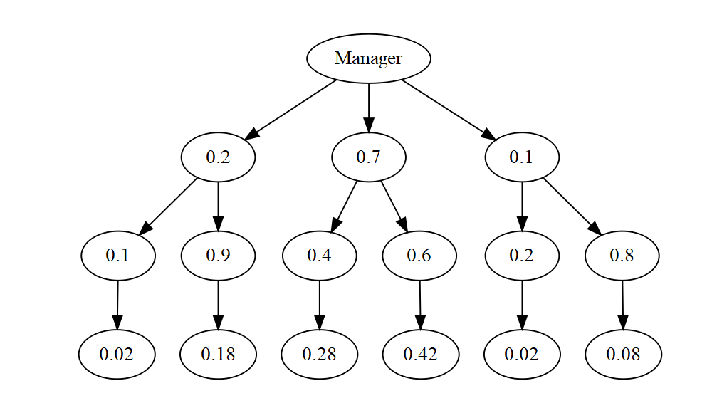

FA5_Afundar_Rodillas
================
Audrie Lex L. Afundar
2024-03-07

``` r
Server1_M<-0.4
Server2_M<-0.25
Server3_M<-0.35
Server1_E<-0.01
Server2_E<-0.02
Server3_E<-0.015

Server1_WE<-(Server1_M*Server1_E)
Server2_WE<-(Server2_M*Server2_E)
Server3_WE<-(Server3_M*Server3_E)

ServerT_WE<-Server1_WE+Server2_WE+Server3_WE

#a.
cat("Probability of receiving a message containing error is:",ServerT_WE*100,"%\n")
```

    ## Probability of receiving a message containing error is: 1.425 %

``` r
#b.
cat("Probability of receiving a message without error is:",(1-ServerT_WE)*100,"%\n")
```

    ## Probability of receiving a message without error is: 98.575 %

``` r
#c.
cat("Probability that it was sent through server 1 is:", ((1-ServerT_WE)*Server1_M)*100,"%\n")
```

    ## Probability that it was sent through server 1 is: 39.43 %

``` r
#a.
A<-0.2
B<-0.7
C<-0.1

A_G<-0.1
B_G<-0.4
C_G<-0.2

A_G_W<-A*A_G
B_G_W<-B*B_G
C_G_W<-C*C_G

A_G_N <- A*(1-A_G)
B_G_N <- B*(1-B_G)
C_G_N <- C*(1-C_G)


P_G<-A_G_W+B_G_W+C_G_W

cat("Probability that a manager at random will not upgrade the computer hardware:",(1-P_G)*100, "%")
```

    ## Probability that a manager at random will not upgrade the computer hardware: 68 %

2.  the posterior probability of B given G, or P(B\|G) means that the
    probability of G happening with the prior B already happening. In
    this case, since B means that they will buy the new graphics
    package, and G means upgrading their computer, it means that the
    posterior probability is the chance of the manager upgrading their
    hardware after buying the new graphics package.

``` r
library(data.tree)
```

    ## Warning: package 'data.tree' was built under R version 4.3.3

``` r
library(webshot2)
```

    ## Warning: package 'webshot2' was built under R version 4.3.3

``` r
root<- Node$new("Manager")

Not_Buying<-root$AddChild(A)
Not_Buying_G<-Not_Buying$AddChild(A_G)
Not_Buying_notG<-Not_Buying$AddChild(1-A_G)
WNot_Buying_G<-Not_Buying_G$AddChild(A_G_W)
NNot_Buying_notG <-Not_Buying_notG$AddChild(A_G_N)

Buying<-root$AddChild(B)
Buying_G<-Buying$AddChild(B_G)
Buying_notG<-Buying$AddChild(1-B_G)
WBuying_G<-Buying_G$AddChild(B_G_W)
NBuying_notG <- Buying_notG$AddChild(B_G_N)

undecided<-root$AddChild(C)
undecided_G<-undecided$AddChild(C_G)
undecided_notG<-undecided$AddChild(1-C_G)
Wundecided_G<-undecided_G$AddChild(C_G_W)
Nundecided_notG <-undecided_notG$AddChild(C_G_N)


plot(root)
```


<!-- -->
(Note: to easily digress the diagram, the 3rd level represents the G of
each denotion (A,B,C). The one on the left represents the G, while the
one on the right represents the not g.)

The tree diagram represents every surveyed managers on their perspective
on whether buying, not, or still undecided, as well as the probability
of them getting an upgrade on their computer hardware. Through the
diagram above, the probability of each decision is easily identifiable
through graph. The probability are as follows:

P(G) = 2% + 28% + 2% therefore, P(G) = 32%

P(B\|G) = 28% P(B not G) = 42%

P(C\|G) = 2% P(not C\| not G) = 18% + 0.42% therefore, P(not C\| not G)
= 60%

``` r
p_spy_internet <- 0.70
p_spy_email <- 0.3
p_detect_int <- 0.6
p_detect_em <- 0.8

p_detect <- (p_spy_internet * p_detect_int) + (p_spy_email * p_detect_em)
p_infect <- 1-p_detect

p_detect_int <- 1 - p_detect *0.7

#a. 
cat("The probability that the spyware infects the system is ", p_infect *100, "% \n")
```

    ## The probability that the spyware infects the system is  34 %

``` r
#b.
cat("The probability that the spyware detected is from the internet is is ", p_detect_int *100, "%")
```

    ## The probability that the spyware detected is from the internet is is  53.8 %
