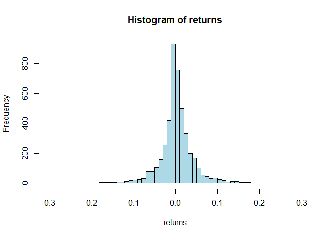
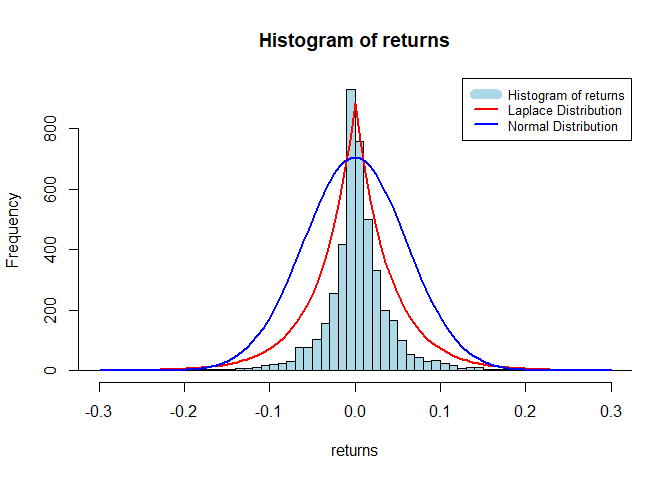

SA2_NUM1
================
Audrie Lex L. Afundar
2024-05-10

## Find out which probability distribution function best fits Bitcoin’s returns for trading data every minute, from January 1, 2012 to April 15, 2024, for Bitcoin quoted in United States dollars or the BTC/USD pair.

Due to the lack of data for 1 minute bitcoin returns, we decided to use
a 1 day bitcoin return so it still fits the date of 2012 - 2024.

Firstly, check if the data is being read properly by checking head and
tail:

``` r
head(df)
```

    ##         Date     Price      Open      High       Low    Vol. Change  X
    ## 1 04/15/2024 63,411.90 65,696.60 66,805.10 62,379.50 118.79K -3.48% NA
    ## 2 04/14/2024 65,697.40 63,909.50 65,758.20 62,174.70 134.40K  2.89% NA
    ## 3 04/13/2024 63,849.90 67,137.40 67,921.00 61,065.50 149.48K -4.92% NA
    ## 4 04/12/2024 67,151.90 70,014.90 71,226.90 65,829.30 131.84K -4.08% NA
    ## 5 04/11/2024 70,011.60 70,620.40 71,249.20 69,586.10  72.51K -0.86% NA
    ## 6 04/10/2024 70,622.10 69,147.80 71,086.90 67,570.00  97.71K  2.13% NA
    ##            X.1       X.2
    ## 1                       
    ## 2          Bin Frequency
    ## 3      -0.5721         1
    ## 4 -0.513286567         0
    ## 5 -0.454473134         0
    ## 6 -0.395659701         1

``` r
tail(df)
```

    ##            Date Price Open High Low    Vol. Change  X X.1 X.2
    ## 4484 01/06/2012   6.7  6.9  7.2 6.1 218.08K -3.60% NA        
    ## 4485 01/05/2012   6.9  5.6  7.2 5.6 182.33K 24.78% NA        
    ## 4486 01/04/2012   5.6  4.9  5.7 4.8 131.17K 14.14% NA        
    ## 4487 01/03/2012   4.9  5.2  5.3 4.7 125.17K -6.51% NA        
    ## 4488 01/02/2012   5.2  5.3  5.5 4.8  69.15K -0.95% NA        
    ## 4489 01/01/2012   5.3  4.7  5.5 4.6 108.51K 11.65% NA

## Histogram of returns

``` r
df$Change <- as.numeric(gsub("%", "", df$Change)) / 100

x_limits <- c(-0.3, 0.3)

hist(df$Change, main = "Histogram of returns", xlab = "returns", ylab = "Frequency", col = "lightblue", breaks = 500, xlim = x_limits)
```

<!-- -->

With this, find the closest fit to the return by using the
Kolmogorv-Smirnov Test. Doing this, the smallest KS test would be the
best fit in the histogram.

There will be 4 distribution test that we would try: Normal, Laplace,
Student (T), and Tsallis.

## Normal Distribution KS Test

``` r
ks_result_normal <- ks.test(df$Change, "pnorm", mean = mean(df$Change), sd = sd(df$Change))
```

    ## Warning in ks.test.default(df$Change, "pnorm", mean = mean(df$Change), sd =
    ## sd(df$Change)): ties should not be present for the Kolmogorov-Smirnov test

``` r
print(ks_result_normal)
```

    ## 
    ##  Asymptotic one-sample Kolmogorov-Smirnov test
    ## 
    ## data:  df$Change
    ## D = 0.19277, p-value < 2.2e-16
    ## alternative hypothesis: two-sided

## Laplace Distribution KS Test

``` r
laplace_pdf <- function(x, mu, b) {
  exp(-abs(x - mu) / b) / (2 * b)
}

laplace_cdf <- function(x, mu, b) {
  integrate(laplace_pdf, lower = -Inf, upper = x, mu = mu, b = b)$value
}

laplace_cdf_data <- sapply(df$Change, function(x) laplace_cdf(x, mu = 0, b = 0.04))

ks_result_laplace <- ks.test(laplace_cdf_data, punif)
```

    ## Warning in ks.test.default(laplace_cdf_data, punif): ties should not be present
    ## for the Kolmogorov-Smirnov test

``` r
print(ks_result_laplace)
```

    ## 
    ##  Asymptotic one-sample Kolmogorov-Smirnov test
    ## 
    ## data:  laplace_cdf_data
    ## D = 0.12476, p-value < 2.2e-16
    ## alternative hypothesis: two-sided

# T Distribution KS Test

``` r
student_pdf <- function(x, df) {
  dt(x, df)
}

student_cdf <- function(x, df) {
  integrate(student_pdf, lower = -Inf, upper = x, df = df)$value
}


student_cdf_data <- sapply(df$Change, function(x) student_cdf(x, df = 5))

ks_result_student <- ks.test(student_cdf_data, punif)
```

    ## Warning in ks.test.default(student_cdf_data, punif): ties should not be present
    ## for the Kolmogorov-Smirnov test

``` r
print(ks_result_student)
```

    ## 
    ##  Asymptotic one-sample Kolmogorov-Smirnov test
    ## 
    ## data:  student_cdf_data
    ## D = 0.44557, p-value < 2.2e-16
    ## alternative hypothesis: two-sided

# Tsallis Distribution KS Test

``` r
rtsal <- function(n, q, beta) {
  u <- runif(n)
  if (q == 1) {
    return(-beta * log(1 - u))
  } else {
    return(sign(q) * beta * (1 - (1 + q * beta * u)^(1/q)))
  }
}
df_test<- rtsal(length(na.omit(df$Change)), mean(na.omit(df$Change)), sd(na.omit(df$Change)))
jittered_data <- jitter(na.omit(df$Change))
ks_result <- ks.test(jittered_data, df_test)
print(ks_result)
```

    ## 
    ##  Asymptotic two-sample Kolmogorov-Smirnov test
    ## 
    ## data:  jittered_data and df_test
    ## D = 0.53018, p-value < 2.2e-16
    ## alternative hypothesis: two-sided

With this, the lowest KS test among the 4 distribution is the Laplace
Distribution, and the second one being the Normal Distribution

To graph the 2 closest one, we did a pseudo theoretical distribution of
the both distribution, to produce a presentable graph.

``` r
hist(df$Change, main = "Histogram of returns", xlab = "returns", ylab = "Frequency", col = "lightblue", breaks = 500, xlim = x_limits)

shifted_laplace_pdf <- function(x) {
  laplace_pdf(x, mu = 0, b = 0.04) * length(df$Change) * diff(range(df$Change)) / 250
}

curve(shifted_laplace_pdf(x), from = x_limits[1], to = x_limits[2], add = TRUE, col = "red", lwd = 2)

shifted_normal_pdf <- function(x) {
  dnorm((x) / 0.06) * length(df$Change) * diff(range(df$Change)) / 10
}

curve(shifted_normal_pdf(x), from = x_limits[1], to = x_limits[2], add = TRUE, col = "blue", lwd = 2)


legend("topright", legend = c("Histogram of returns", "Laplace Distribution", "Normal Distribution"), 
       col = c("lightblue", "red", "blue"), lwd = c(10, 2, 2, 2, 2), lty = c(1, 1, 1, 1, 1), cex = 0.8)
```

<!-- -->
